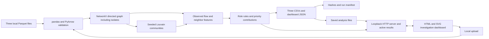

# Money Graph — HackAlem AI

**An explainable, local transaction-network investigation dashboard by Jiggle Eagles**, built for the Freedom / Finance hackathon task.

Bank anti-money-laundering (AML) analysts need to decide which accounts to review first and understand how money moves through a sampled network. Money Graph turns three Parquet files into a directed graph, six structural role hypotheses, communities, an explained review queue, and downloadable results. Analysts can search an exact client ID and inspect the measurements behind each conclusion.

**Roles, scores, and communities are hypotheses for human investigation, never accusations.** Observed transfers do not establish complete account balances or prove wrongdoing.

For a first run, follow [Setup](#setup), then the [reproducible judge walkthrough](#reproducible-judge-walkthrough). The main application is Python; the repository also retains a [separate Node/React starter](#legacy-node-starter).

## What has been implemented

- **Validated local analysis:** load `nodes.parquet`, `edges.parquet`, and `transactions.parquet`; check schemas, IDs, dates, amounts, and agreement between transactions and aggregated edges.
- **Complete account coverage:** preserve every supplied node, including isolates, and assign a role, confidence score, community, priority, and readable evidence.
- **Explainable results:** six documented role rules, separate priority contributions, deterministic Louvain communities, and measured fan-in, fan-out, and potential bridging descriptions.
- **Investigation dashboard:** exact client-ID search, ranked review queue, account details, role/community coloring, payer → recipient arrows, and one- or two-hop graph exploration with zoom and pan.
- **Uploads and saved analyses:** processing status, safe publication after success, persistent local history, editable titles/descriptions, duplicate-file labels, and reopening of saved results after hash verification.
- **Reproducible exports:** the three required CSVs, supplementary dashboard JSON, and a manifest containing hashes, algorithm settings, versions, and timing.
- **Interface preferences:** English, Kazakh, and Russian; Light, Dark, and System themes; separate Analyses and Results views and layouts for narrow screens.

## How the solution works

1. **Provide inputs:** upload the three files in the browser or point the CLI at a directory containing them.
2. **Validate and build:** reconcile individual transfers with edge aggregates, then insert all accounts and directed payer → recipient connections into the graph.
3. **Calculate:** measure observed flows and counterparties, find communities, evaluate role rules, and calculate each account's investigation priority.
4. **Review:** open the results, choose an account from the queue or search by ID, inspect its explanation, and explore its neighborhood and community.
5. **Export or revisit:** download the CSVs and manifest, edit the saved analysis details, or reopen a previous analysis without recalculating it.

The CLI and browser uploads use the same calculation pipeline. An unsuccessful upload leaves the currently selected analysis and its downloads available.

## Technologies

| Component | Technologies and purpose |
| --- | --- |
| Analysis | Python; pandas and PyArrow for Parquet/data frames; NumPy for numeric validation; NetworkX for directed graphs and Louvain communities |
| Local backend | Python standard-library HTTP server, threading, JSON, filesystem storage, and SHA-256 hashing |
| Dashboard | HTML, CSS, plain JavaScript modules, and SVG; local JSON translation catalogs and browser locale formatting |
| Verification | Python `unittest`, Playwright with Chromium for browser tests, and GitHub Actions configuration |
| Retained starter | TypeScript, Node.js, React, Vite, Tailwind CSS, Express, Zod, and an optional OpenAI SDK helper; a Dockerfile for this starter only |

The exact Python interpreter is defined by [`.python-version`](.python-version); runtime and test package pins are in [requirements-money-graph.txt](requirements-money-graph.txt) and [requirements-money-graph-test.txt](requirements-money-graph-test.txt). Node uses [`.nvmrc`](.nvmrc) and [package-lock.json](package-lock.json).

**Money Graph calculations run locally without AI, a database or a cloud service.** An optional investigation agent uses the OpenAI Responses API only when an analyst starts a review. Its tools retrieve saved measurements; model suggestions are hypotheses with validated evidence. The retained Node starter's opt-in OpenAI helper remains separate from the Python investigation agent. Codex assistance during development is documented in [disclosures](disclosures/README.md).

## Architecture



| Repository path | Responsibility |
| --- | --- |
| [`money_graph/pipeline.py`](money_graph/pipeline.py) | Input validation, graph construction, metrics, roles, communities, ranking, and exports |
| [`money_graph/__main__.py`](money_graph/__main__.py) | CLI arguments, batch execution, and optional dashboard launch |
| [`money_graph/server.py`](money_graph/server.py) | Loopback HTTP API, upload worker, active results, history, metadata, downloads, and bounded graph retrieval |
| [`money_graph/static/`](money_graph/static/) | Dashboard views, SVG graph, themes, and EN/KZ/RU catalogs |
| [`money_graph/i18n.py`](money_graph/i18n.py) | Structured messages for validation and explanations |
| [`scripts/`](scripts/) | Pinned-environment setup, validation, and launch commands |
| [`tests/`](tests/) | Synthetic fixtures, calculation/HTTP/setup checks, and real browser journeys |
| [`frontend/`](frontend/) and [`backend/`](backend/) | Separate legacy Node/React connectivity starter |

Financial calculations live in the Python pipeline. The browser receives exact client IDs as decimal strings to avoid JavaScript integer precision loss. Successful uploads prepare inputs and exports in their own directories, then publish a complete result snapshot and download bytes together. Storage is local files; there is no database.

## Setup

Run commands from the repository root using Bash on macOS/Linux or WSL. Install the **exact Python version in [`.python-version`](.python-version)** first. If you already use `uv`, this installs it:

```bash
uv python install "$(cat .python-version)"
```

`uv` is optional; an installed matching interpreter on PATH also works. Then create/check the isolated environment and start the upload interface:

```bash
./scripts/setup.sh
./scripts/money-graph.sh --serve --upload-only
```

Open [http://127.0.0.1:8765](http://127.0.0.1:8765). Choose the three input files and click **Analyze files**. Stop the server with Ctrl+C. No environment activation, Node build, `.env`, API key, or database is needed. Installation needs internet or cached packages; analysis runs locally.

**For reviewers:** run the commands in your own terminal and keep it open throughout the demonstration. Wait for `Dashboard: http://127.0.0.1:8765` before opening the page; that line is printed only after the server binds successfully. The running command normally does not return to the shell prompt. Closing the terminal or stopping its process makes the local URL unavailable. Opening a browser tab alone does not start the application, and a preview started by a development tool may end with that tool's session.

If the browser reports **connection refused**, check the launch terminal first. If the command has exited, read its error and rerun the launch command after addressing it. For missing dependencies, rerun `./scripts/setup.sh`; for missing input files, prepare the input directory documented below or pass `--data /path/to/parquet`. If the port is occupied, choose `./scripts/money-graph.sh --serve --port 8766` and open the printed URL. Refresh the browser after the server is ready. In a second terminal, `curl --fail http://127.0.0.1:8765/api/overview` checks whether the server responds with the loaded dataset. A machine restart requires launching the server again.

Setup reuses a compatible project-local `.venv` and installs exact package pins. Setup and launch reject the wrong interpreter, external/shared environments, and system packages; launch also checks runtime dependency pins and ignores ambient Python import paths. Rerun setup for missing/drifted packages. For an incompatible or incomplete `.venv`, move it aside before rerunning setup; the script does not replace it automatically. To select an installed interpreter when creating the environment:

```bash
MONEY_GRAPH_PYTHON=/absolute/path/to/python ./scripts/setup.sh
```

### Analyze existing files in one command

With the environment ready, a single command recalculates the supplied reference dataset, writes all results, and opens the local server:

```bash
./scripts/money-graph.sh --data docs/my-docs/data --serve
```

Use those files only within the organizer-authorized hackathon scope; see [Data and integrations](#data-and-integrations). Alternatively, obtain the authorized organizer archive and place its three Parquet files in the default input directory:

```text
data/private/money-graph/input/
  nodes.parquet
  edges.parquet
  transactions.parquet
```

Then run:

```bash
./scripts/money-graph.sh --serve
```

| Purpose | Command |
| --- | --- |
| Start with uploads and saved history, no selected analysis | `./scripts/money-graph.sh --serve --upload-only` |
| Generate exports from the default input directory and exit | `./scripts/money-graph.sh` |
| Use custom input/output directories and port | `./scripts/money-graph.sh --data /path/to/parquet --out /path/to/results --serve --port 8766` |

The module entry point is also available as `.venv/bin/python -m money_graph`. Inputs are never modified. Invalid input exits nonzero before replacing existing exports; retained exports therefore belong to the previous successful run, identified by its manifest. Avoid concurrent writers to the same output directory. Opening `money_graph/static/index.html` directly displays a launch guide; analysis requires the local server.

## Reproducible judge walkthrough

This five-minute scenario uses the existing **synthetic test fixture**, so no organizer dataset access or credentials are needed. It is a functional demonstration, not evidence of AML accuracy.

### 1. Generate sample input and launch

After setup, stop any server already using port 8765, then run:

```bash
.venv/bin/python - <<'PYTHON'
from pathlib import Path
import runpy

fixture = runpy.run_path("tests/test_money_graph.py")
fixture["write_fixture"](Path("data/private/money-graph/judge-demo/input"))
PYTHON

./scripts/money-graph.sh \
  --data data/private/money-graph/judge-demo/input \
  --out data/private/money-graph/judge-demo/output \
  --serve
```

Open [the local dashboard](http://127.0.0.1:8765). Results should contain **30 accounts, 6 directed connections, 7 transfers, 23 isolates, 25 communities, and 30 ranked accounts**. The output directory contains all three CSVs, `dashboard.json`, and `run_manifest.json`.

### 2. Inspect three accounts

Select English and search these exact synthetic IDs using **Find a client ID**:

| Client ID | Expected result and point to explain |
| --- | --- |
| `9007199254740995` | `transit`, role score `0.80`; 3 incoming peers, 1 outgoing peer, and 30,000 KZT in each direction. Transit and consolidator rules both qualify; transit wins and the ambiguity deduction lowers confidence. |
| `9007199254740999` | Isolated `peripheral` account; no connections, role score `0.10`, priority `0`. The account is retained and searchable. |
| `9007199254741022` | Depth-four `peripheral` account with 30,000 KZT incoming and no observed outgoing transfer; role score `0.12`. The boundary warning explains why missing onward links cannot establish terminal status. |

For the first account, follow payer → recipient arrows, switch **Color by** between Role and Cluster, expand to two hops, zoom/pan, and reset the graph. Inspect its rule, priority contributions, and community description. Switch language or theme and confirm the account and graph state remain available.

### 3. Upload, save, and download

Return to **Analyses**, select the three files from `data/private/money-graph/judge-demo/input/`, and click **Analyze files**. After success, open Analyses again: the saved run appears in **Previous analyses**, with a separate ID and a matching-files label because the startup analysis used the same bytes. Use **Edit details** to set a title and optional description, then reopen the run. Download the CSVs and manifest from Results; the node and ranking CSVs each contain 30 data rows.

To check persistence, stop the server and restart with the same output directory:

```bash
./scripts/money-graph.sh --serve --upload-only \
  --out data/private/money-graph/judge-demo/output
```

Saved analyses remain listed; opening one restores its original results and exports without recalculation.

### 4. Reproduce the organizer dataset, when authorized

```bash
./scripts/money-graph.sh --data docs/my-docs/data \
  --out data/private/money-graph/judge-official
```

For the inspected reference files, the repository records **2,248 accounts, 3,119 connections, 4,840 transactions, 19 isolates, 88 communities, and 50 ranked accounts**. Check the fresh `run_manifest.json` for input hashes, parameters, versions, and elapsed processing time. The organizer's target is a complete raw-input-to-export run in under five minutes; installation and server uptime are separate. Historical local verification is recorded in [requirements](docs/hackathon/requirements.md) and [disclosures](disclosures/verification-limits-16-08.md); it is not a cross-machine performance guarantee.

## Using the dashboard

**Navigation and graph.** Analyses places the upload form above saved history. Startup with an active dataset, a successful upload, or reopening a saved run displays Results, initially inspecting the highest-priority account. Use **Analyses** or **All analyses** to return; **Results** or **View results** returns to the loaded analysis. Exact-ID search includes accounts omitted from the graph view and isolates. Click a node or ID to inspect another account. Dashed nodes mark depth four. Community colors repeat; explicit community IDs distinguish them.

The graph starts at one hop and expands to two. Distance follows connections in either direction while arrows preserve transfer direction. The **50-account cap includes the selected account**; selection is shortest hop first, then exact numeric ID. The caption reports visible, eligible, and omitted accounts, and all directed edges between visible accounts are shown, including self/reciprocal links. The full incident-connection table remains available. This display cap does not remove accounts from calculations, search, or exports. Drag to pan, use +/− or the mouse wheel to zoom; keyboard arrows pan a focused graph. **Reset graph** restores the one-hop view. Display distance is separate from original collection depth.

**Uploads and history.** Upload all three files from the same dataset with their exact filenames. The limit is **64 MiB total, including multipart framing**, with one analysis at a time. Status shows receiving, validating, analyzing, exporting, success, or failure. Failed uploads are removed, their errors appear beside the form, and active results stay available. Files go only to the loopback server on this computer.

Successful uploads remain under `<out>/uploads/<run-id>/input/` and `output/`. History is newest first and survives restarts using the same output directory. Every upload receives a unique analysis ID, even if the input files match. A SHA-256 fingerprint over the three named input-file hashes labels byte-identical datasets; it does not merge runs or establish algorithm-version equivalence. Reopening verifies saved artifact hashes; damaged/missing artifacts produce an error without replacing current results. Unreadable history metadata is reported. Selection is shared across tabs connected to the server; refresh another tab after switching analyses. Stale inspection/expansion requests receive a reload message.

**Editable details.** Titles are required (1–120 characters); optional descriptions allow multiple lines (up to 2,000 characters) and can be cleared. Save persists changes; Cancel discards drafts. Metadata lives in `analysis_details.json`, separate from calculation artifacts, and user-written text is unchanged by language selection. A new CLI startup run receives default details rather than inheriting the prior startup title.

A normal restart recalculates `--data`. An upload-only restart starts with no selected analysis and lets you open saved history. To independently recalculate a saved upload using the default output layout:

```bash
# Replace RUN_ID with the ID shown in the saved analysis.
./scripts/money-graph.sh \
  --data "data/private/money-graph/output/uploads/RUN_ID/input" \
  --out data/private/money-graph/replayed --serve
```

**Language and appearance.** Select EN · English, KZ · Қазақша, or RU · Русский. Kazakh uses the `kk` locale; a saved `kz` preference is accepted as an alias. Saved language preference takes precedence over supported browser languages, with English fallback. Dates/numbers are localized; exact IDs, canonical role keys, CLI diagnostics, and exports are preserved. Browsers without Kazakh locale data use a local formatting fallback. Translations are AI-assisted and have not received independent native-speaker review.

Light/Dark/System theme selection defaults to System, follows operating-system changes in that mode, and persists when browser storage is available. Theme and language switching preserve investigation state. Themes, fonts, scripts, and translations require no external asset service.

<details>
<summary>Maintaining translations</summary>

Edit matching keys in [`money_graph/static/locales/`](money_graph/static/locales/), preserving named placeholders such as `{gid}` and `{count}`. Use `t(key, params)` for dynamic text and `data-i18n`/`data-i18n-aria-label`/`data-i18n-placeholder` attributes for text-only HTML; never interpolate translations as HTML. New languages also need registration in `static/i18n.js`, the HTML selector, and the server catalog allowlist. The direct-file guide in `static/file-preview.js` keeps its own strings because `file:` cannot fetch catalogs. Python validation and community descriptions supply structured message keys and measured values. Tests check matching catalog keys/placeholders and browser behavior.

</details>

## Data and integrations

The organizer supplies a one-off batch export of **July 1–31, 2026 intra-bank transfers**, collected by following outgoing transfers from **81 seed clients through four hops**, with a **5,000 KZT minimum individual transfer**. The repository contains the [source dataset README](docs/my-docs/README.md), [task specification](docs/my-docs/task.md), and an [inspected data profile with SHA-256 provenance](docs/hackathon/data-profile.md).

| Input file | Required columns | Interpretation |
| --- | --- | --- |
| `nodes.parquet` | `gid, depth, is_seed` | One anonymized client per row; exact int64 ID, minimum discovery hop 0–4, and seed flag |
| `edges.parquet` | `src, dst, sum_kzt, n_tx, depth` | One ordered payer → recipient pair; aggregate KZT and transfer count; discovery hop 1–4 |
| `transactions.parquet` | `src, dst, date, sum_kzt` | Individual transfers, with float64 KZT amounts and day-level dates, without time or timezone |

Working inputs/results use ignored `data/private/`. **Reference copies of all three Parquet files are tracked under [`docs/my-docs/data/`](docs/my-docs/data/)**; ignoring the working directory does not remove those copies or their history. Dataset use is authorized for the hackathon, not implicitly for redistribution. Setup preserves the reference files. There is no automatic demo fallback: the synthetic walkthrough creates its inputs explicitly.

No bank API, live transaction stream, customer enrichment or external translation service participates in Money Graph. The optional investigation agent sends selected graph evidence to OpenAI only after a review is started; calculations and manual exploration require no key. Its HTTP endpoints are local interfaces implemented in `server.py`:

| Local interface | Purpose |
| --- | --- |
| `POST /api/analysis`, `GET /api/status` | Upload the three files and inspect processing status |
| `GET /api/analyses` | List saved analyses |
| `POST /api/analyses/<id>/open` and `/details` | Reopen an analysis or update its title/description |
| `GET /api/overview`, `/api/account?gid=...`, `/api/graph?gid=...&hops=1` | Retrieve results and account neighborhoods (one or two hops) |
| `GET /exports/<filename>` | Download the selected analysis's three CSVs or run manifest |

Mutation routes enforce local same-origin requests. The server binds to `127.0.0.1`; these interfaces are not a hosted public API.

## Optional investigation agent

Inside **Analyses → Analysis details**, choose **Review whole graph**. Python scans every supplied account for shared recipients, directed connections between communities and repeated connections across dates. A bounded, diverse shortlist is investigated with read-only tools. The interface separately reports accounts scanned, candidates found and candidates examined; a partial review does not imply the remaining graph is clear.

Select a suggestion to focus its accounts and open **Findings, Checks and Evidence**. Closing the investigation restores your prior graph and zoom. **Mark for follow-up** persists a marker; **Prepare brief** opens a dialog and saves the validated suggestion, evidence, checks and original method provenance with the analysis. Search and manual exploration remain available.

Put `OPENAI_API_KEY` in the ignored root `.env` file or export it in the server's environment. Never put a real key in `.env.example`. Money Graph reads these backend settings; the key is never returned to the browser. Default model: `gpt-5.4-2026-03-05`, medium reasoning. No paid startup, health or normal test calls are made. The existing Node helper is independent.

```dotenv
# Store an actual key only in .env (ignored by Git).
OPENAI_API_KEY=your-key-here
OPENAI_MODEL=gpt-5.4-2026-03-05
MONEY_GRAPH_AI_MAX_USD=0.75
MONEY_GRAPH_AI_INPUT_USD_PER_MILLION=2.50
MONEY_GRAPH_AI_OUTPUT_USD_PER_MILLION=15.00
```

Default limits are six shortlisted candidates, 36 tool calls, 40 model calls, 250,000 cumulative tokens, 6,000 output tokens per request, 180 seconds and $0.75 per review. Before each request, the backend reserves a conservative input/output cost against the configured prices. Unknown model overrides require explicit prices. Estimates charge cached input at the full input rate; provider billing remains authoritative. A request whose response is lost retains an explicit uncertain cost reservation and is never automatically retried. Cancellation stops further work, preserves accepted findings, and ignores late suggestions; an already transmitted request can still incur usage. An interrupted review is recorded on server restart. One AI review runs at a time.

Reviews, snapshot copies and briefs are stored in `<out>/investigations/`, separate from the required CSVs and manifest. Tools resolve the review's saved snapshot, independently of the analysis selected in another tab. Compatible completed reviews can be reused; calculation, discovery, tool, prompt, model, locale or budget changes invalidate reuse. New analyses are required to calculate new algorithms or add daily evidence to legacy results. Old briefs retain their original evidence.

Run paid evaluation explicitly on **generated synthetic data only**:

```bash
.venv/bin/python -u scripts/evaluate-investigation.py --live --budget-usd 1
```

The report at `data/private/money-graph/evaluation.json` records tool choices, validated decisions, rejected structured outputs, latency, usage, a deterministic candidate baseline and a human-review rubric. The two cases contrast observed onward activity with collection-boundary absence. This is a small live integration evaluation, not an AML accuracy benchmark. Mocked tests establish contracts and lifecycle behavior, not model quality. [Investigation contract](docs/money-graph/investigation.md) documents modules and acceptance criteria; the [implementation and live-evaluation disclosure](disclosures/investigation-agent-17-43.md) records the observed results and remaining limits.

## Outputs

Default directory: `data/private/money-graph/output/`.

| File | Exact required columns |
| --- | --- |
| `nodes_roles.csv` | `gid,role,role_score,cluster_id,priority_score,evidence` |
| `clusters.csv` | `cluster_id,n_nodes,n_seed,sum_kzt_internal,top_gids,hypothesis` |
| `top_nodes.csv` | `rank,gid,role,priority_score,why` |

There is one role row per supplied node, including isolates, and up to 50 ranked accounts (all accounts for smaller fixtures). The official dataset produces 50, exceeding the minimum 20. Evidence is nonempty and at most 200 characters. Scores are finite in [0,1].

CSV encoding is UTF-8 with LF endings. Gids remain exact decimal int64 values; import the ID column as text in spreadsheet tools to avoid their precision limits. Scores and amounts serialize to six decimals. `top_gids` is a JSON array of up to five exact decimal **strings**, ordered by priority then numeric gid. Cluster IDs start at zero. Nodes sort by numeric gid; ranks sort by descending six-decimal priority then ascending numeric gid.

`dashboard.json` contains the same results plus measured features, directed links, daily directed aggregates, actual method settings and frozen method descriptions, using **strings** for identifiers across browser/JSON boundaries. New calculation snapshots retain their original descriptions when algorithms or translations change. Older snapshots remain readable with explicit missing temporal/method capabilities. `run_manifest.json` records input/output SHA-256 hashes, algorithm parameters, dependency/Python versions, platform, start time and elapsed processing time. CSVs and dashboard JSON are deterministic; the manifest's timing fields intentionally vary.

## Rules and scores

Let `I` and `O` be distinct incoming and outgoing **other clients**, `K` the number of distinct communities among all neighbors, and `R = observed outgoing KZT / observed incoming KZT`. `R` is undefined when incoming KZT is zero; ratios above one remain above one. They do not establish retention, fund lineage or balances. Seed membership adds no priority.

All qualifying rules are evaluated:

| Role hypothesis | Eligibility | Base confidence |
| --- | --- | --- |
| `consolidator` | `I ≥ 3` and `I ≥ 2O` | `0.55 + 0.35 × min(I/10, 1)` |
| `distributor` | `O ≥ 5` and `O ≥ 2I` | `0.55 + 0.35 × min(O/20, 1)` |
| `coordinator` | `I ≥ 2`, `O ≥ 2`, `K ≥ 3` | `0.55 + 0.35 × min(K/6, 1)` |
| `transit` | Non-seed; `I,O > 0`; `0.8 ≤ R ≤ 1.2` | `0.55 + 0.35 × (1 − abs(R−1)/0.2)` |
| `terminal` | Non-seed; depth <4; `I > 0`, `O = 0` | `0.45 + 0.15 × min(I/5, 1)` |
| `peripheral` | No other rule qualifies | `0.10` with no other peers, otherwise `0.20` |

The highest base confidence wins. Exact six-decimal ties resolve in order: coordinator, consolidator, distributor, transit, terminal, peripheral. Subtract 0.10 if multiple rules match, then multiply by 0.60 at depth four and by 0.85 for seeds. The dashboard lists competing rules. A depth-four account can be a consolidator based on observed fan-in, but **cannot receive the terminal role**. Even below depth four, `terminal` means a candidate endpoint in this partial observation only.

Confidence is heuristic support for a structural role, not a calibrated probability. Thresholds are transparent first-version choices, not learned or tuned to labeled truth. The peripheral score describes weak evidence, not innocence or guilt.

Investigation priority is independent of the selected role. Let `B` count distinct peers in other communities, `T = in_tx + out_tx`, `V = in_kzt + out_kzt`, and `Vmax` be the maximum `V` in this dataset:

```text
priority = 0.30 × min(I/10, 1)
         + 0.25 × min(O/10, 1)
         + 0.20 × min(B/5, 1)
         + 0.15 × min(T/30, 1)
         + 0.10 × log(1+V) / log(1+Vmax)
```

The last term is zero for an edgeless dataset. Each contribution is rounded to six decimals before summing; ties use exact numeric gid. High amounts alone contribute at most 0.10. `V` is incident activity, not unique money; self-transfers contribute to both incoming and outgoing totals/counts, but not distinct other peers. Daily activity counts are descriptive only; there is no inferred intraday order.

## Validation and communities

Required columns, integer IDs, nulls, seed/depth consistency, endpoint membership, duplicate gids/pairs, positive transaction counts, finite KZT amounts, the 5,000 KZT threshold and July day-level dates are checked. Transactions must match every directed edge's count and aggregate amount, within `0.01 KZT + 1e-12 × transaction sum`. Float64 source amounts retain their precision; this is not a financial ledger. Repeated transaction rows are retained. Edge aggregates are the single source for graph amounts after reconciliation, so transactions are not counted again as extra turnover.

All nodes are inserted before edges. Community detection uses NetworkX weighted Louvain on an **undirected projection**, adding reciprocal KZT weights and excluding self-links only from community affinity. Parameters: seed 42, resolution 1.0, threshold 1e-7. Node/edge insertion is sorted. Isolates get singleton communities. Communities are numbered by their smallest exact numeric gid. This is reproducibility for the pinned environment, not a claim that alternative thresholds or algorithms yield the same partition.

Cluster summaries retain size, seeds, role composition, internal directed links and boundary membership, and add independently measured patterns across all observed peers (including peers outside the community):

- **Fan-in:** at least 3 incoming peers and at least twice as many incoming as outgoing peers.
- **Fan-out:** at least 5 outgoing peers and at least twice as many outgoing as incoming peers.
- **Potential bridging:** an account has an incoming peer and an outgoing peer in different communities. This is structural adjacency, not proof of intermediary activity or traced funds.

Descriptions report candidate counts and a supporting account with peer counts and observed KZT for fan patterns, or neighbor-community and cross-community-peer counts for bridging. Example selection uses the largest relevant count, then exact numeric gid. Communities with no qualifying pattern say so. Each description includes depth-four boundary counts, seeds and missing incoming flows, the outgoing-only four-hop collection, July/intra-bank scope, the 5,000 KZT threshold and the distinction between observed flows and balances. These additions change descriptions only; the role and priority rules above are unchanged. Internal KZT counts each directed transfer once when both endpoints share the cluster. Algorithmic communities are not verified organizations. More details: [methodology](docs/money-graph/methodology.md).

## Automated checks

Run the existing calculation, validation, export, localization, setup, and real HTTP tests after setup:

```bash
.venv/bin/python -m unittest discover -s tests -p 'test_*.py' -v
```

Install the test-only dependencies and Chromium, then run the real dashboard/backend browser journeys:

```bash
./scripts/setup.sh --test
.venv/bin/python -m playwright install chromium
.venv/bin/python -m unittest discover -s tests -p 'browser_*.py' -v
```

These checks use synthetic fixtures by default and need permission to open loopback sockets and launch Chromium. On Linux, Chromium may also need system libraries; the CI command uses `python -m playwright install --with-deps chromium` through `.venv/bin/python`. To additionally exercise the main journey on authorized reference data:

```bash
MONEY_GRAPH_TEST_DATA=docs/my-docs/data \
  .venv/bin/python -m unittest discover -s tests -p 'browser_*.py' -v
```

Coverage includes deterministic outputs, all-node preservation, role/priority formulas, collection-boundary handling, upload failures preserving active results, saved-analysis reopening/editing, precise-ID search, bounded graph exploration, exports, localization, themes, and narrow layouts. No paid or live AI request is part of these checks.

[GitHub Actions](.github/workflows/jiggles-ci.yml) defines separate Python/browser and legacy Node jobs. A workflow file does not establish a successful remote run. See the [current investigation verification](disclosures/investigation-agent-17-43.md) and [earlier verification limits](disclosures/verification-limits-16-08.md) for local checks, the unrelated unfinished security-test failure, and remaining gaps. Remote CI for the current uncommitted changes, independent second-machine setup, Docker execution, and the live organizer presentation remain unverified.

## Limitations and next scale

- **Partial observation:** outgoing-only collection, the four-hop boundary, missing outside incoming funds, other-bank transfers, and amounts below 5,000 KZT prevent complete balance or fund-lineage conclusions. All 444 depth-four accounts in the reference data are excluded from the terminal rule.
- **Heuristic inference:** there are no labeled correct roles. Confidence is not a calibrated probability, communities are not verified organizations, and tests do not establish AML detection accuracy. Threshold sensitivity and partition robustness have not been measured.
- **Fixed data contract:** validation currently enforces July 2026 dates, the 5,000 KZT threshold, and the documented depth/schema rules. This is not a general-purpose import format or live banking integration.
- **Local operation:** one analysis runs at a time, uploads are capped at 64 MiB, and graph views show at most 50 accounts. There is no authentication, multi-user access control, database, production hosting, or verified Money Graph container. Saved selection is shared across browser tabs.
- **Deferred capabilities:** advanced manual filters, a raw transaction viewer, cycle analysis, node-removal simulation, chat, and full-network force-layout visualization are not implemented. The investigation agent can inspect communities, daily aggregates and repeated directed connections; it cannot establish intraday order or fund lineage.
- **Translation review:** EN/KZ/RU catalogs are present; independent native-speaker review is still needed.

At approximately **one million nodes**, the current in-memory pandas/NetworkX approach would need redesign: columnar scans, compact on-disk graph storage, indexed neighborhoods, and partitioned or approximate algorithms. Results should be served in bounded pages without loading the whole graph into browser memory. Community stability, scoring thresholds, runtime, and memory would need measurement on representative large data. These are proposed changes, not implemented scale claims.

## Deployment

**No deployed Money Graph URL is documented in this repository.** The supported version runs locally at [http://127.0.0.1:8765](http://127.0.0.1:8765) after launch. The existing Dockerfile and Docker launcher package the legacy Node starter. Money Graph has no verified public hosting or container configuration; see [deployment readiness](docs/hackathon/deployment-readiness.md).

## Legacy Node starter

The separate `frontend/` and `backend/` workspaces provide a health/echo connectivity app. They are retained in the repository and are not required for the Money Graph dashboard. To run them, activate the Node version from `.nvmrc` and its bundled npm:

```bash
source "$HOME/.nvm/nvm.sh"  # If nvm is not already loaded.
nvm use
npm ci
npm run dev
```

Vite listens on `127.0.0.1:5173`; Express uses port 3000 by default, with `/api` proxied from Vite. `.env.example` documents optional server configuration. Check and build this starter separately:

```bash
npm run typecheck
npm test
npm run build
npm start
```

`npm start` serves the existing production build through Express. The optional server-only OpenAI helper in `backend/src/openai.ts` uses the Responses API with `OPENAI_API_KEY` and `OPENAI_MODEL`; that helper requires explicitly exported settings. It is not wired into the health/echo routes or Money Graph. Its tests mock transport, so they do not demonstrate live-model readiness. There is no configured Node lint or Node browser-test command.

## Sources and attribution

The repository includes the organizer's [task specification](docs/my-docs/task.md), [dataset documentation](docs/my-docs/README.md), and [Python starter](docs/my-docs/starter/README.md). The recorded original sources are the [official specification](https://docs.google.com/document/d/1JPLU-G6R25Ge2hVaY2J9cqvrx7FGExj87XKwJPaMz3o/edit?usp=sharing), [dataset README](https://drive.google.com/file/d/1ro-SiY042jv7De0h7tXBDyY8ZKdHz_US/view?usp=sharing), [dataset archive](https://drive.google.com/file/d/1yHdWaSb6gwPAUrqco-KrwR2U_YhzFQFT/view?usp=sharing), and [starter archive](https://drive.google.com/file/d/1EnMGG22jSH7Mvgt396kKRi3bjAobsomN/view?usp=sharing). Retrieval dates and hashes are recorded in the [data profile](docs/hackathon/data-profile.md).

Money Graph extends the organizer starter's Parquet loading, directed-graph metrics, and CSV contracts with all-node preservation, validation, rules, communities, ranking, and a local dashboard. [Requirements](docs/hackathon/requirements.md) map implementation to acceptance criteria; [methodology](docs/money-graph/methodology.md) explains the analysis. [Disclosures](disclosures/README.md) describe AI/tool assistance, data handling, dependencies, licenses, and verification limits.
