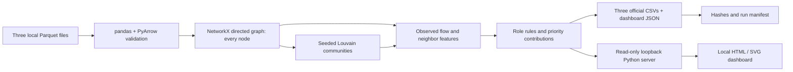

# Money Graph — HackAlem AI

A small, local AML investigation dashboard for the **Freedom / Finance** task, by **Jiggle Eagles**. Python, pandas and NetworkX turn the organizer's three Parquet files into explainable role hypotheses, communities and a review queue. Findings are **hypotheses for human investigation, never accusations**.

The first version works end to end: validation, all-node directed graph, six role rules, reproducible communities, three official CSVs, client-ID search, directed connections and account explanations. It has no application LLM, training, database, authentication or cloud dependency. The existing Node/React connectivity starter is retained separately; it is not needed to run Money Graph.

## Setup

Use Bash on macOS/Linux (or WSL), from the repository root. The exact Python interpreter is pinned in [`.python-version`](.python-version); application packages are pinned in [requirements-money-graph.txt](requirements-money-graph.txt). Install that interpreter first. If you use uv, `uv python install "$(cat .python-version)"` installs it. An existing matching Python on PATH also works; uv is optional.

```bash
./scripts/setup.sh
```

After preparing the input directory below, run `./scripts/money-graph.sh --serve` and open **http://127.0.0.1:8765**. Setup creates the project-local `.venv`, installs exact package versions, and checks dependency consistency. No activation, Node build, `.env`, API key or database is needed. Installation needs internet (or cached packages); analysis stays local. Ctrl+C stops the server.

**For reviewers:** run the commands in your own terminal and keep it open throughout the demonstration. Wait for `Dashboard: http://127.0.0.1:8765` before opening the page; that line is printed only after the server binds successfully. The running command normally does not return to the shell prompt. Closing the terminal or stopping its process makes the local URL unavailable. Opening a browser tab alone does not start the application, and a preview started by a development tool may end with that tool's session.

If the browser reports **connection refused**, check the launch terminal first. If the command has exited, read its error and rerun the launch command after addressing it. For missing dependencies, rerun `./scripts/setup.sh`; for missing input files, prepare the input directory documented below or pass `--data /path/to/parquet`. If the port is occupied, choose `./scripts/money-graph.sh --serve --port 8766` and open the printed URL. Refresh the browser after the server is ready. In a second terminal, `curl --fail http://127.0.0.1:8765/api/overview` checks whether the server responds with the loaded dataset. A machine restart requires launching the server again.

Setup reuses an existing compatible `.venv`; it never deletes or replaces an incompatible environment. Both setup and launch reject the wrong Python version, external/shared virtual environments and system packages. Launch also checks every runtime package pin before importing the app and ignores ambient Python import paths. To repair missing/drifted packages, rerun setup. For a wrong interpreter or incomplete environment, move the old `.venv` aside first. Use `MONEY_GRAPH_PYTHON=/absolute/path/to/python ./scripts/setup.sh` to select an installed interpreter explicitly when creating the environment.

| Purpose | Command |
| --- | --- |
| Money Graph setup | `./scripts/setup.sh` |
| Dashboard, analyze existing local inputs | `./scripts/money-graph.sh --serve` |
| Export results without serving | `./scripts/money-graph.sh` |
| Older Node starter only | `npm run dev`, `npm start`, `scripts/start.sh`, `scripts/start-docker.sh` |

For startup from existing files, prepare the input directory below.

Obtain the authorized [organizer dataset archive](https://drive.google.com/file/d/1yHdWaSb6gwPAUrqco-KrwR2U_YhzFQFT/view?usp=sharing). Extract **only** its `data/nodes.parquet`, `data/edges.parquet` and `data/transactions.parquet` into:

```text
data/private/money-graph/input/
  nodes.parquet
  edges.parquet
  transactions.parquet
```

For this working copy the inputs have already been retrieved and verified. Working inputs, downloaded archives and generated results use ignored `data/private/`. **The repository also contains tracked reference copies of the three Parquet files in `docs/my-docs/data/`**, identical to the verified inputs; ignoring `data/private/` does not exclude those copies or remove their Git history. They remain unchanged by setup. The existing Docker allowlist excludes both locations. Reviewers still need organizer authorization to use the dataset; repository access does not imply permission to redistribute it. [Data contract and hashes](docs/hackathon/data-profile.md) identify the verified files. There is no implicit demo-data fallback.

## One-command reproduction and dashboard

```bash
./scripts/money-graph.sh --serve
```

This validates raw Parquet, recomputes every result, writes the exports and serves **http://127.0.0.1:8765**. Ctrl+C stops the server. No Node build or network access is required. To produce outputs and exit, omit `--serve`:

```bash
./scripts/money-graph.sh
# Explicit locations or an alternative local port:
./scripts/money-graph.sh --data /path/to/parquet --out data/private/money-graph/output --serve --port 8766
```

The same command is available as `.venv/bin/python -m money_graph`. Inputs are never modified. Validation failures exit nonzero before replacing existing results. A failed run leaves the **previous** exports intact; use the successful run manifest to identify their inputs. Avoid concurrent writers to the same output directory.

The dashboard opens the highest-priority account. Search any exact decimal client ID, including isolates. Inspect measured flows, role confidence, the matched rule, priority contributions, community description and neighboring accounts. Switch coloring between role and community. Arrows point **payer → recipient**. Graph pages show 16 peers at a time with visible totals; “All observed directed connections” lists every incident edge. Click a node or ID to continue tracing. Links among neighbors are outside this one-account view. Dashed nodes mark depth four. Community colors repeat; explicit community IDs distinguish them.

## Outputs

Default directory: `data/private/money-graph/output/`.

| File | Exact required columns |
| --- | --- |
| `nodes_roles.csv` | `gid,role,role_score,cluster_id,priority_score,evidence` |
| `clusters.csv` | `cluster_id,n_nodes,n_seed,sum_kzt_internal,top_gids,hypothesis` |
| `top_nodes.csv` | `rank,gid,role,priority_score,why` |

There is one role row per supplied node, including isolates, and up to 50 ranked accounts (all accounts for smaller fixtures). The official dataset produces 50, exceeding the minimum 20. Evidence is nonempty and at most 200 characters. Scores are finite in [0,1].

CSV encoding is UTF-8 with LF endings. Gids remain exact decimal int64 values; import the ID column as text in spreadsheet tools to avoid their precision limits. Scores and amounts serialize to six decimals. `top_gids` is a JSON array of up to five exact decimal **strings**, ordered by priority then numeric gid. Cluster IDs start at zero. Nodes sort by numeric gid; ranks sort by descending six-decimal priority then ascending numeric gid.

`dashboard.json` contains the same results plus measured features and directed links, using **strings** for identifiers across browser/JSON boundaries. `run_manifest.json` records input/output SHA-256 hashes, algorithm parameters, dependency/Python versions, platform, start time and elapsed processing time. CSVs and dashboard JSON are deterministic; the manifest's timing fields intentionally vary.

## Rules and scores

Let `I` and `O` be distinct incoming and outgoing **other clients**, `K` the number of distinct communities among all neighbors, and `R = observed outgoing KZT / observed incoming KZT`. `R` is undefined when incoming KZT is zero; ratios above one remain above one. They do not establish retention, fund lineage or balances. Seed membership adds no priority.

All qualifying rules are evaluated:

| Role hypothesis | Eligibility | Base confidence |
| --- | --- | --- |
| `consolidator` | `I ≥ 3` and `I ≥ 2O` | `0.55 + 0.35 × min(I/10, 1)` |
| `distributor` | `O ≥ 5` and `O ≥ 2I` | `0.55 + 0.35 × min(O/20, 1)` |
| `coordinator` | `I ≥ 2`, `O ≥ 2`, `K ≥ 3` | `0.55 + 0.35 × min(K/6, 1)` |
| `transit` | Non-seed; `I,O > 0`; `0.8 ≤ R ≤ 1.2` | `0.55 + 0.35 × (1 − abs(R−1)/0.2)` |
| `terminal` | Non-seed; depth <4; `I > 0`, `O = 0` | `0.45 + 0.15 × min(I/5, 1)` |
| `peripheral` | No other rule qualifies | `0.10` with no other peers, otherwise `0.20` |

The highest base confidence wins. Exact six-decimal ties resolve in order: coordinator, consolidator, distributor, transit, terminal, peripheral. Subtract 0.10 if multiple rules match, then multiply by 0.60 at depth four and by 0.85 for seeds. The dashboard lists competing rules. A depth-four account can be a consolidator based on observed fan-in, but **cannot receive the terminal role**. Even below depth four, `terminal` means a candidate endpoint in this partial observation only.

Confidence is heuristic support for a structural role, not a calibrated probability. Thresholds are transparent first-version choices, not learned or tuned to labeled truth. The peripheral score describes weak evidence, not innocence or guilt.

Investigation priority is independent of the selected role. Let `B` count distinct peers in other communities, `T = in_tx + out_tx`, `V = in_kzt + out_kzt`, and `Vmax` be the maximum `V` in this dataset:

```text
priority = 0.30 × min(I/10, 1)
         + 0.25 × min(O/10, 1)
         + 0.20 × min(B/5, 1)
         + 0.15 × min(T/30, 1)
         + 0.10 × log(1+V) / log(1+Vmax)
```

The last term is zero for an edgeless dataset. Each contribution is rounded to six decimals before summing; ties use exact numeric gid. High amounts alone contribute at most 0.10. `V` is incident activity, not unique money; self-transfers contribute to both incoming and outgoing totals/counts, but not distinct other peers. Daily activity counts are descriptive only; there is no inferred intraday order.

## Validation and communities

Required columns, integer IDs, nulls, seed/depth consistency, endpoint membership, duplicate gids/pairs, positive transaction counts, finite KZT amounts, the 5,000 KZT threshold and July day-level dates are checked. Transactions must match every directed edge's count and aggregate amount, within `0.01 KZT + 1e-12 × transaction sum`. Float64 source amounts retain their precision; this is not a financial ledger. Repeated transaction rows are retained. Edge aggregates are the single source for graph amounts after reconciliation, so transactions are not counted again as extra turnover.

All nodes are inserted before edges. Community detection uses NetworkX weighted Louvain on an **undirected projection**, adding reciprocal KZT weights and excluding self-links only from community affinity. Parameters: seed 42, resolution 1.0, threshold 1e-7. Node/edge insertion is sorted. Isolates get singleton communities. Communities are numbered by their smallest exact numeric gid. This is reproducibility for the pinned environment, not a claim that alternative thresholds or algorithms yield the same partition.

Cluster summaries report size, seeds, role composition, internal directed links and boundary membership. Internal KZT counts each directed transfer once when both endpoints share the cluster. Algorithmic communities are not verified organizations. More details: [methodology](docs/money-graph/methodology.md).

## Verification

The supplied data produced **2,248 accounts, 3,119 edges, 4,840 transactions, 19 isolates, 88 communities and 50 ranked accounts**. Two local runs took approximately **0.3 seconds each** for input hashing, parsing, validation, analysis and export on macOS arm64 / Python 3.14.6. Dependency installation and serving are excluded. This is well below five minutes on this machine, not a cross-machine performance guarantee.

Verified: exact official schemas and gid coverage; scores and evidence constraints; cluster member/seed counts and internal amounts; ranking order; all 444 boundary nodes excluded from terminal; byte-identical CSV and dashboard JSON across repeated runs; shuffled-input invariance on fixtures. Detailed local evidence is in ignored `data/private/money-graph/verification.json` and each run manifest.

```bash
# Synthetic calculation, validation, export/reproducibility and real HTTP tests:
.venv/bin/python -m unittest discover -s tests -p 'test_*.py' -v

# One-time browser-test setup:
./scripts/setup.sh --test
.venv/bin/python -m playwright install chromium

# Real dashboard + backend on synthetic data (no mocks):
.venv/bin/python -m unittest discover -s tests -p 'browser_*.py' -v

# Also run that journey on the private official data:
MONEY_GRAPH_TEST_DATA=data/private/money-graph/input \
  .venv/bin/python -m unittest discover -s tests -p 'browser_*.py' -v
```

Browser checks cover exact-ID search, edge directions, role/cluster coloring, graph navigation, explanations, isolates, depth-four warnings, missing/invalid IDs, exports, pagination on the supplied graph and mobile overflow. No app requests leave loopback. Tests require loopback sockets; sandboxed environments must permit them.

The retained Node starter is checked separately, with the version pinned in `.nvmrc`:

```bash
source "$HOME/.nvm/nvm.sh"  # if nvm is not already loaded
nvm use
npm ci                    # only when dependencies are not installed
npm run typecheck
npm test
npm run build
```

Its `npm run dev`, `npm start` and `scripts/start.sh` still launch the earlier connectivity app, not this Python dashboard. Existing optional AI code is not invoked by Money Graph. No changes were made to its API, dependencies or configuration. Remote CI for the final changes and Docker execution remain unverified; no push was made. The CI workflow defines separate jobs for Money Graph and the Node starter. Money Graph reads `.python-version`, runs `scripts/setup.sh --test`, installs Chromium and runs the Python/setup/HTTP and browser suites on synthetic inputs. Remote Actions execution remains pending until an authorized push.

## Architecture



`money_graph/pipeline.py` owns calculations; `server.py` owns read-only routes; `static/` only displays results. No financial calculations are hidden in UI code. [Requirements](docs/hackathon/requirements.md) map the implementation to acceptance checks.

## Limitations and next scale

The collection follows outgoing transfers from 81 seeds for four hops. Missing onward edges at depth four, missing external incoming flows, other banks and amounts below 5,000 KZT prevent complete flow/balance conclusions. No customer attributes are invented or externally enriched. No role ground truth exists; passing tests establishes implementation behavior, not AML accuracy. Transit ratios do not prove the same money moved onward. Terminal, coordinator and community labels require independent investigation. This small version does not perform temporal matching, sensitivity analysis or full-network force-layout visualization.

For roughly one million nodes, replace in-memory pandas/NetworkX with columnar scans, compact graph storage and partitioned/approximate algorithms. Index account neighborhoods on disk and serve bounded results; avoid loading all results into RAM or a browser. Reassess community stability, thresholds, runtime and memory on representative data. The current benchmark does not establish performance at that scale.

A five-minute walkthrough: reproduce, show the three exports, inspect a high-priority node, then a depth-four account and an isolate. Explain one role rule and its priority contributions. A live presentation to organizers remains to be performed.

## Sources and attribution

The [official specification](https://docs.google.com/document/d/1JPLU-G6R25Ge2hVaY2J9cqvrx7FGExj87XKwJPaMz3o/edit?usp=sharing), [dataset README](https://drive.google.com/file/d/1ro-SiY042jv7De0h7tXBDyY8ZKdHz_US/view?usp=sharing) and [organizer Python starter](https://drive.google.com/file/d/1EnMGG22jSH7Mvgt396kKRi3bjAobsomN/view?usp=sharing) were inspected September 23, 2026. This implementation extends the starter's load/DiGraph/flow-feature/export structure, fixing isolate omission and adding validation, rules, clustering, ranking and viewing. See [DISCLOSURES.md](DISCLOSURES.md) for dependency licenses and AI/tool assistance.
