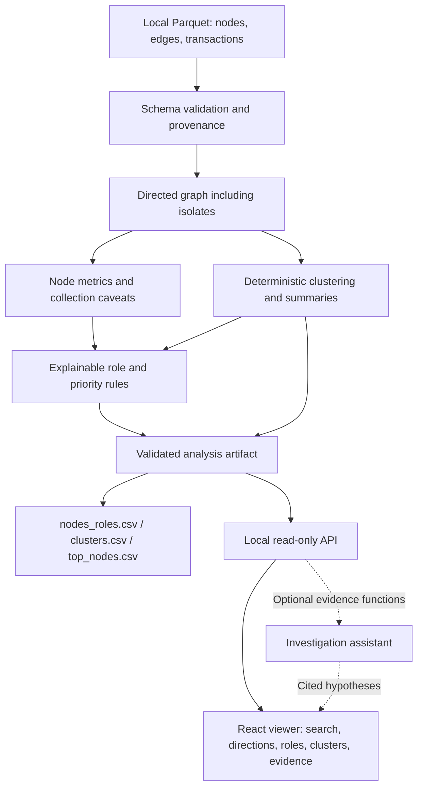

# Money Graph architecture

**Proposed design — graph components are not implemented.** The existing app is a React/Vite frontend and Express backend with health/echo routes. This diagram is preparation for MG-09 and must be checked against the delivered implementation.

The local pipeline owns numeric analysis; the API serves completed results and the frontend displays them. Graph calculations and ranking rules belong outside UI components and AI prompts. Decide the Parquet/graph runtime after inspecting the organizer starter; no new runtime or dependency is selected here.

A run should retain input hashes, schema/rule version, algorithm parameters, deterministic seed when needed and elapsed time. Validate output coverage, score ranges and CSV schemas before reporting success. Missing/invalid input or analysis failure must produce an explicit failure rather than fabricated or partial successful output.

The core pipeline and viewer must work without an LLM. If an assistant is added, it calls validated read-only graph functions and cites actual gids/metrics; external-service failure leaves core analysis available. Any external data transmission requires authorization. Raw data and investigation exports stay in ignored local storage, outside the public source and Docker context.
