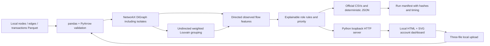

# Delivered local architecture

`money_graph/pipeline.py` validates, calculates and serializes. `money_graph/__main__.py` runs the pipeline and optionally serves; `scripts/money-graph.sh` provides the one-command entry point. `money_graph/server.py` holds the active result snapshot, local upload/status routes and bounded graph retrieval, binding to 127.0.0.1. Uploaded files are analyzed in a separate local run; a locked snapshot swap publishes data and downloads only after successful validation, calculation and export. Failed runs preserve active results; successful inputs and outputs remain under the output directory’s `uploads/` subdirectory. `money_graph/static/` displays search, account evidence, communities and bounded one/two-hop directed neighborhoods with visible peer connections, zoom, pan and reset. JSON gids are strings to preserve int64 precision.

The three CSV schemas remain exactly as specified. Dashboard JSON is a deterministic supplementary artifact; timing lives in a separate manifest. Inputs and outputs remain in ignored private local storage. No application LLM, model training, database, authentication, cloud services or external UI assets are required.

The existing Node/React connectivity starter remains separately runnable and is not in this path. There is no Python Docker image or production deployment in this iteration.
